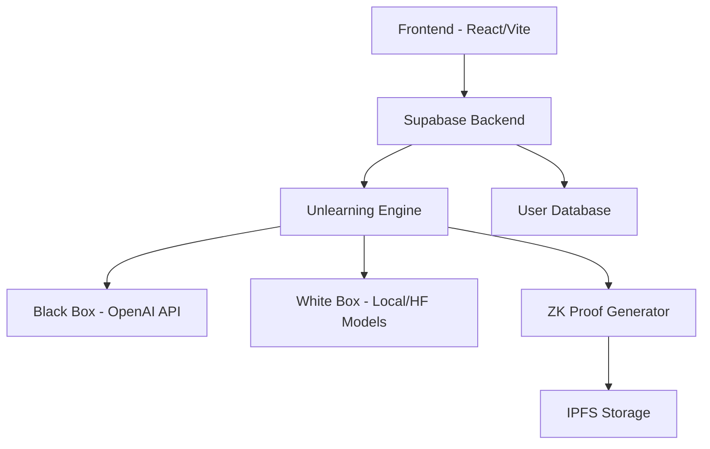

# Forg3t Protocol

AI unlearning with ZK proofs

## What is Forg3t

The Forg3t Protocol enables provable AI unlearning - the cryptographic removal of specific information from AI models. Organizations can ensure sensitive data is permanently forgotten by AI systems while generating verifiable certificates of compliance.

Our solution combines adversarial testing and zero-knowledge proofs to create an immutable audit trail. Unlike simple data deletion, Forg3t provides cryptographic evidence that information has been effectively removed from model behavior.

## Architecture (Simple)

### Components

- **Frontend**: React + TypeScript, Vite, Tailwind CSS
- **Backend**: Supabase with serverless functions
- **Unlearning Engine**: Black-box (OpenAI) and white-box (local/Hugging Face) modules
- **ZK Proof Generator**: Creates and verifies cryptographic proofs
- **IPFS Storage**: Certificate and artifact storage
- **Proof Indexer**: Planned component for proof discovery

## Quick Start

### Prerequisites

- Node.js LTS
- npm or pnpm
- Supabase CLI

### Try at hello.forg3t.io

## Tech Architecture

For detailed technical architecture documentation, please contact us at hello@forg3t.io

## API and Function Endpoints

- `POST /functions/create-request`: Create new unlearning request
  - Request: `{ user_id, target_text, reason }`
  - Response: `{ request_id, status }`

- `POST /functions/run-suppression`: Execute black-box suppression
  - Request: `{ request_id, api_key, target_text }`
  - Response: `{ success, leak_score, results }`

- `POST /functions/generate-proof`: Create ZK proof
  - Request: `{ request_id, test_results }`
  - Response: `{ proof_id, proof_data }`

- `POST /functions/store-ipfs`: Save certificate to IPFS
  - Request: `{ certificate_data }`
  - Response: `{ ipfs_hash }`

- `POST /functions/issue-certificate`: Generate PDF certificate
  - Request: `{ request_id, verification_data }`
  - Response: `{ certificate_id, download_url }`

## Compliance and Security

The protocol aligns with GDPR Article 17 (Right to Erasure) by providing cryptographic evidence of information removal from AI systems.

### Security Features

- Audit-ready logs for all unlearning operations
- PII handling through target text anonymization
- Encryption at rest for sensitive database fields
- Cryptographic signing of all PDF certificates
- Optional OpenAI integration (can be disabled)

### Threat Model

- [Planned] Detailed threat model in `docs/threat_model.md`

## Roadmap

### MVP Goals
- Enhanced proof verification system
- Demo application with ZK proofs

### Mainnet Goals
- SDK v1 release
- Enhanced dashboard with metrics
- Proof indexer for discovery
- Third-party security review

### White Box Rollout
- Local model weight manipulation
- Hugging Face integration
- Multiple unlearning techniques

### Public Goods Award Path
- Ongoing maintenance and improvements
- Community contribution guidelines
- Documentation and educational resources

## Contribution

Contributions are welcome! Please read our contribution guidelines and code of conduct before submitting pull requests.

## License

MIT License 
